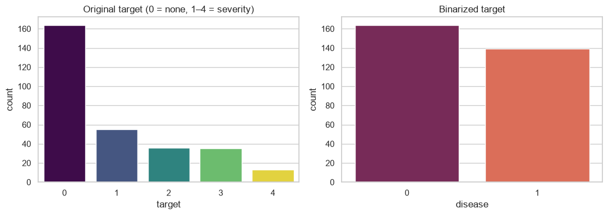
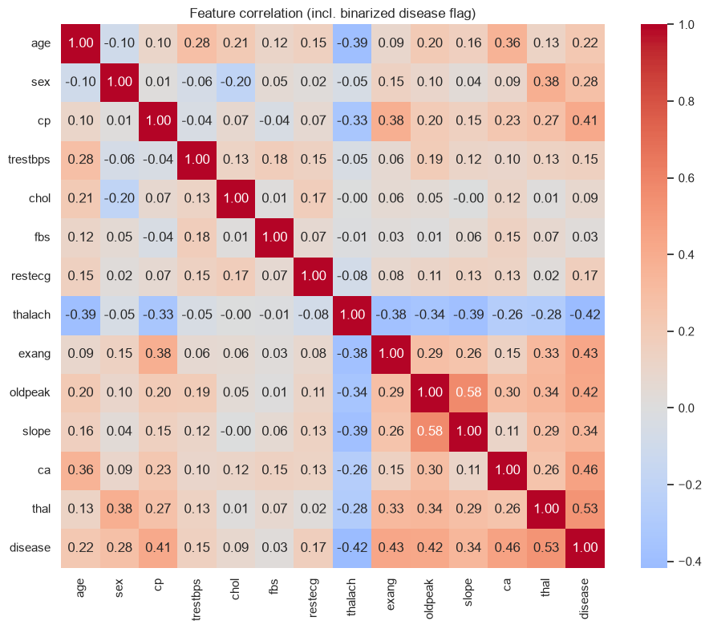
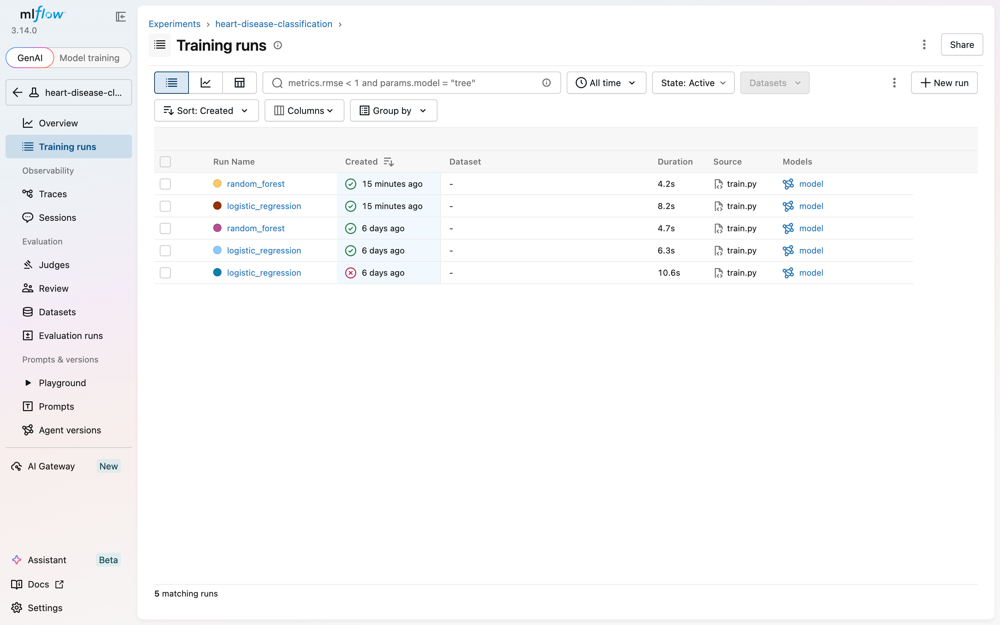
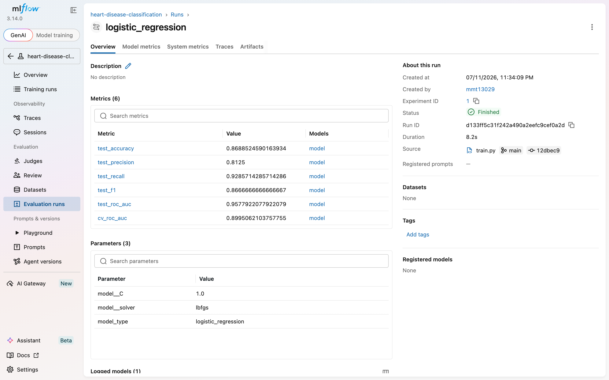
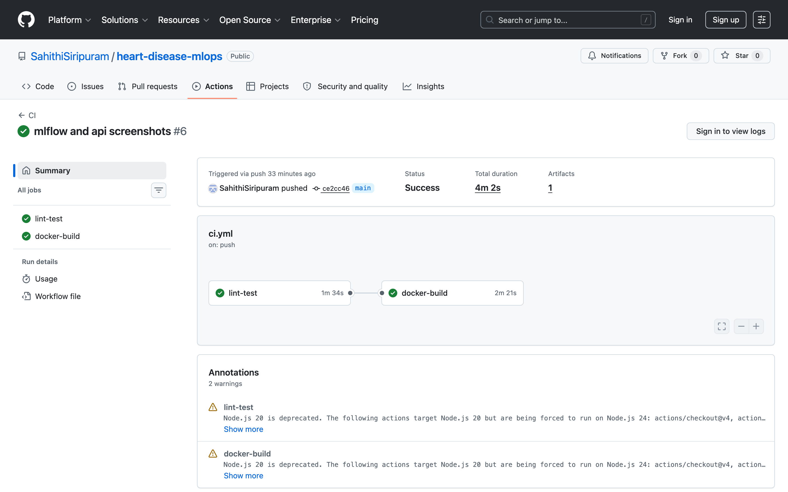
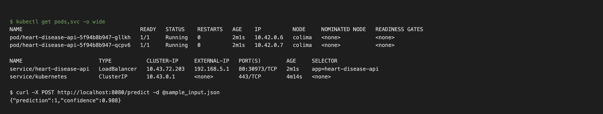
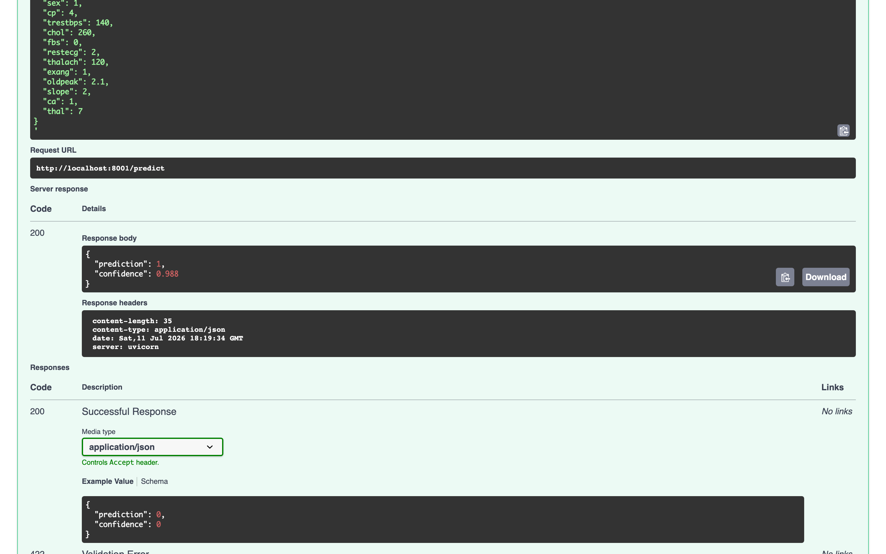
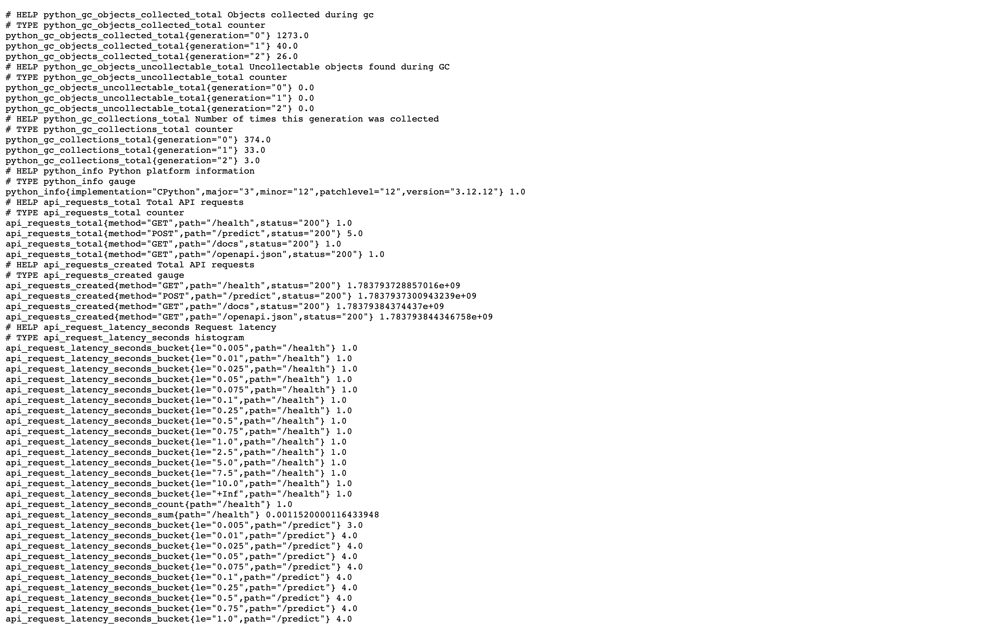

# Heart Disease Risk Prediction — MLOps Pipeline Report

**Course:** Machine Learning Operations (MLOps) AIMLCZG523 — Assignment 01
**Author:** Sahithi Siripuram
**Repository:** https://github.com/SahithiSiripuram/heart-disease-mlops
**Deployed API:** local Kubernetes (colima/k3s v1.35), 2 replicas behind a
LoadBalancer service — reachable at `http://localhost:8080` via
`kubectl port-forward svc/heart-disease-api 8080:80`

---

## 1. Project overview

This project builds a binary classifier that predicts the risk of heart disease
from patient health data (UCI Heart Disease dataset) and delivers it as a
production-ready, monitored API. The emphasis is on the operational pipeline:
reproducible preprocessing, experiment tracking, automated testing and CI/CD,
containerization, Kubernetes deployment, and monitoring.

### Architecture

```
┌─────────────┐   ┌──────────────────┐   ┌─────────────────────┐
│ UCI dataset  │──▶│ download script  │──▶│ EDA + preprocessing │
└─────────────┘   └──────────────────┘   │ (ColumnTransformer) │
                                          └──────────┬──────────┘
                                                     ▼
┌──────────────┐   ┌──────────────────┐   ┌─────────────────────┐
│ MLflow       │◀──│ GridSearchCV     │◀──│ LogReg / RandForest │
│ tracking     │   │ 5-fold, ROC-AUC  │   └─────────────────────┘
└──────────────┘   └────────┬─────────┘
                            ▼ best model (joblib pipeline)
┌──────────────┐   ┌──────────────────┐   ┌─────────────────────┐
│ GitHub       │──▶│ Docker image     │──▶│ Kubernetes          │
│ Actions CI   │   │ FastAPI /predict │   │ 2 replicas + LB     │
└──────────────┘   └──────────────────┘   └──────────┬──────────┘
                                                     ▼
                                          ┌─────────────────────┐
                                          │ logs + /metrics     │
                                          │ (Prometheus format) │
                                          └─────────────────────┘
```


## 2. Data acquisition & EDA

- **Source:** UCI ML Repository, Heart Disease dataset (Cleveland), fetched
  programmatically via `ucimlrepo` (`python -m src.data.download`); 303 rows,
  13 features.
- **Target:** raw values 0–4 (0 = no disease, 1–4 = severity) binarized to
  presence/absence — classes are near-balanced (54% / 46%).
- **Missing values:** only `ca` (4 rows) and `thal` (2 rows) — imputed
  (median / most-frequent) instead of dropped.

Key EDA findings (full analysis in `notebooks/01_eda.ipynb`):

- Strongest signals: `thalach` (max heart rate, negatively associated),
  `oldpeak`/`slope` (exercise ST depression), `cp` (asymptomatic chest pain
  type 4 dominates the disease class), `ca`, `thal`, `exang`.
- Weak signals: `chol`, `fbs`, `trestbps`.
- Mixed numeric/categorical features motivate a ColumnTransformer with scaling
  (needed by logistic regression) and one-hot encoding.





## 3. Feature engineering & modelling

Preprocessing is a sklearn `ColumnTransformer` embedded in the model pipeline,
so identical transforms run at training and inference:

- numeric (`age`, `trestbps`, `chol`, `thalach`, `oldpeak`, `ca`): median
  imputation + standard scaling
- categorical (`sex`, `cp`, `fbs`, `restecg`, `exang`, `slope`, `thal`):
  most-frequent imputation + one-hot encoding (`handle_unknown="ignore"`)

Two models were tuned with 5-fold GridSearchCV (scoring: ROC-AUC) over the
full pipeline on an 80/20 stratified split:

| Model | Grid | Accuracy | Precision | Recall | F1 | ROC-AUC (test) | ROC-AUC (CV) |
|---|---|---|---|---|---|---|---|
| Logistic Regression | C ∈ {0.01, 0.1, 1, 10}, solver ∈ {lbfgs, liblinear} | 0.869 | 0.813 | 0.929 | 0.867 | **0.958** | 0.900 |
| Random Forest | trees ∈ {100, 300}, depth ∈ {∞, 4, 8}, min-leaf ∈ {1, 3, 5} | 0.885 | 0.839 | 0.929 | 0.881 | 0.943 | 0.900 |

**Model selection:** both models tie on cross-validated ROC-AUC (0.900);
logistic regression was selected for its higher test ROC-AUC, simplicity, and
interpretability — appropriate for a small (303-row) clinical dataset where a
high-variance model gains little. Recall (0.929) matters most in this domain:
missing an at-risk patient is costlier than a false alarm.

## 4. Experiment tracking (MLflow)

Every training run (`python -m src.models.train`) creates one MLflow run per
model logging: best hyperparameters, all test metrics + CV ROC-AUC, the ROC
curve and confusion matrix as figures, and the fitted pipeline as a model
artifact.





## 5. Model packaging & reproducibility

- Best pipeline exported to `models/model.joblib` (+ `model_metadata.json`
  with its metrics); models also stored per-run in MLflow.
- Clean-environment setup from `requirements.txt` alone; dataset fetched by
  script — no manual steps, verified in CI from scratch on every push.
- Fixed random seeds (splits, estimators) for reproducibility.

## 6. CI/CD (GitHub Actions)

`.github/workflows/ci.yml`, on every push/PR to `main`:

1. **lint-test job:** flake8 → pytest (8 tests: preprocessing behavior, API
   contract incl. validation errors) → dataset download → model training →
   upload of MLflow runs + model as build artifacts.
2. **docker-build job:** trains the model, builds the Docker image, boots the
   container, and smoke-tests `/health` and `/predict` with sample input.

The pipeline fails on any lint error, test failure, or build/smoke-test error.



## 7. Containerization & deployment

- **Docker:** `python:3.11-slim` base, dependencies from `requirements.txt`,
  serving via uvicorn on port 8000; `.dockerignore` keeps context minimal.
- **Kubernetes:** `deployment/deployment.yaml` (2 replicas, CPU/memory
  requests+limits, liveness/readiness probes on `/health`) and
  `deployment/service.yaml` (LoadBalancer → 8000).

Deployed on a local k3s cluster (colima). Both replicas pass their probes and
the model answers through the cluster service; on colima the LoadBalancer's
external IP is VM-internal, so the service is accessed from the host with
`kubectl port-forward`:





## 8. Monitoring & logging

- Structured request logging middleware: method, path, status, latency per request.
- Prometheus metrics at `/metrics`: `api_requests_total` (by method/path/status),
  `api_request_latency_seconds` histogram, `predictions_total` (by class) —
  ready to scrape with Prometheus/Grafana.



## 9. Setup instructions

See `README.md` for full commands. Summary:

```bash
python -m venv .venv && source .venv/bin/activate
pip install -r requirements.txt
python -m src.data.download
python -m src.models.train
pytest && flake8 src tests
uvicorn src.api.main:app --reload
```

## 10. Repository link

https://github.com/SahithiSiripuram/heart-disease-mlops
